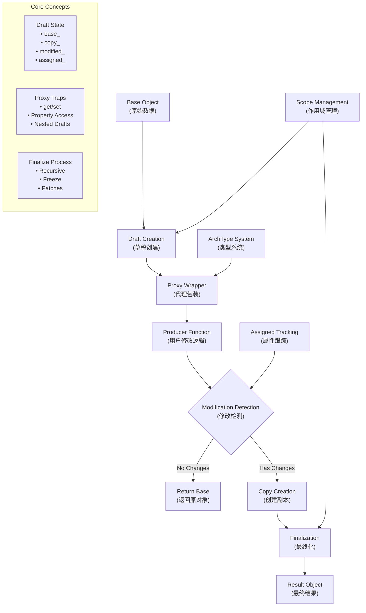

# Immer 核心概念深度解析

## 概述

本文档深入解析immer源码中的核心概念，帮助理解immer实现**"透明的不可变更新"**的技术原理。这些概念相互配合，形成了完整的不可变数据处理架构。

## 1. Scope（作用域）- 生命周期管理核心

### 核心概念

**Scope（作用域）** 是immer中管理每次 `produce`调用生命周期的核心机制。它提供了：

- **隔离性**：每次produce调用都有独立的执行环境
- **层次性**：支持嵌套produce调用，形成作用域栈
- **资源管理**：跟踪和清理所有相关资源
- **错误恢复**：异常安全保证

### 关键数据结构

```typescript
interface ImmerScope {
  drafts_: any[]              // 收集本次调用的所有草稿
  parent_?: ImmerScope        // 父级作用域引用
  patches_?: Patch[]          // 补丁记录
  canAutoFreeze_: boolean     // 自动冻结控制
  immer_: Immer              // Immer实例引用
  unfinalizedDrafts_: number  // 未最终化草稿计数
}
```

### 生命周期管理

```typescript
// 1. 创建作用域并入栈
function enterScope(immer: Immer): ImmerScope {
  return {
    drafts_: [],
    parent_: currentScope,
    patches_: undefined,
    canAutoFreeze_: true,
    immer_: immer,
    unfinalizedDrafts_: 0
  }
}

// 2. 正常离开作用域
function leaveScope(scope: ImmerScope) {
  currentScope = scope.parent_
}

// 3. 异常撤销作用域
function revokeScope(scope: ImmerScope) {
  currentScope = scope.parent_
  // 撤销所有草稿的代理
  scope.drafts_.forEach(draft => {
    draft[DRAFT_STATE].revoke_()
  })
}
```

### 作用域栈机制

```typescript
// 全局作用域栈
let currentScope: ImmerScope | undefined

// 嵌套调用示例
const result = produce(state1, draft1 => {
  draft1.a = 1

  // 嵌套调用会创建新作用域
  const nested = produce(state2, draft2 => {
    draft2.b = 2
    return draft2
  })

  draft1.nested = nested
})
```

### 设计优势

- **性能优化**：只处理当前作用域的草稿
- **内存安全**：防止草稿对象泄漏
- **嵌套支持**：任意深度的produce调用
- **错误隔离**：异常不会影响其他作用域

## 2. Draft（草稿）- 最核心概念

**草稿**是immer的核心抽象，代表原始数据的"可修改版本"：

```typescript
// 草稿对象包含特殊的内部状态
const draft = {
  [DRAFT_STATE]: {
    type_: ArchType.Object,    // 数据结构类型
    scope_: currentScope,      // 所属作用域
    modified_: false,          // 是否被修改
    finalized_: false,         // 是否已最终化
    base_: originalObject,     // 原始对象
    copy_: null,              // 修改副本（延迟创建）
    assigned_: {},            // 属性修改跟踪
    parent_: parentDraft,     // 父级草稿
    revoke_: revokeFunction   // 代理撤销函数
  }
}
```

**设计亮点**：

- **透明性**：用户感觉像在直接修改对象
- **延迟拷贝**：只有真正修改时才创建副本
- **状态跟踪**：精确记录哪些部分被修改

## 3. Base vs Copy 机制 - 写时复制核心

这是写时复制的核心实现：

```typescript
interface ImmerState {
  base_: any      // 原始对象 - 不可变的源数据
  copy_: any      // 修改副本 - 延迟创建，包含所有变更
  modified_: boolean  // 修改标记
}

// 读取时：优先从copy_读取，fallback到base_
function peek(draft, prop) {
  const state = draft[DRAFT_STATE]
  return (state.copy_ || state.base_)[prop]
}

// 写入时：触发copy创建
function prepareCopy(state) {
  if (!state.copy_) {
    state.copy_ = shallowCopy(state.base_)  // 浅拷贝
  }
}
```

**核心优势**：

- **结构共享**：未修改部分继续共享原始数据
- **性能优化**：避免不必要的拷贝操作
- **内存效率**：只为修改的路径分配新内存

## 4. Proxy 代理机制 - 透明修改的技术核心

Proxy是实现透明修改的技术核心：

```typescript
const objectTraps: ProxyHandler = {
  get(state, prop) {
    // 透明读取：用户感觉在直接访问属性
    return peek(latest(state), prop)
  },

  set(state, prop, value) {
    // 写时复制：首次修改时创建副本
    if (!state.modified_) {
      prepareCopy(state)      // 创建副本
      markChanged(state)      // 标记修改
    }
    state.copy_[prop] = value
    state.assigned_[prop] = true  // 记录属性被修改
    return true
  }
}
```

**关键特性**：

- **属性拦截**：劫持所有属性访问和修改
- **嵌套代理**：自动将嵌套对象也转为草稿
- **状态传播**：子对象修改会标记父对象为已修改

## 5. Assigned 属性跟踪系统 - 精确变化检测

这是immer最精妙的设计之一，用于**精确跟踪属性变化**：

```typescript
interface ProxyObjectState {
  assigned_: {
    [property: string]: boolean  // true=设置, false=删除, undefined=未修改
  }
}

// 示例：跟踪具体的属性变化
const state = {
  assigned_: {
    'name': true,     // 属性被设置了新值
    'age': false,     // 属性被删除
    'email': undefined // 属性未被触碰
  }
}
```

**应用场景**：

- **补丁生成**：知道具体哪些属性发生了变化
- **性能优化**：跳过未修改的属性
- **精确更新**：只处理真正变化的部分

## 6. ArchType 架构类型系统 - 多数据结构支持

immer支持4种数据结构，每种都有特定的处理策略：

```typescript
enum ArchType {
  Object = 0,    // 普通对象：使用Proxy劫持属性
  Array = 1,     // 数组：继承对象处理 + 长度维护
  Map = 2,       // Map：特殊的键值对处理
  Set = 3        // Set：最复杂，需要重建整个集合
}

// 不同类型的不同处理策略
function createProxy(base, parent) {
  const state = {
    type_: getArchtype(base),  // 确定处理策略
    base_,
    copy_: null,
    // ... 其他状态
  }

  switch (state.type_) {
    case ArchType.Object:
    case ArchType.Array:
      return new Proxy(base, objectTraps)  // 使用Proxy
    case ArchType.Map:
    case ArchType.Set:
      return getPlugin("MapSet").proxyMap(base)  // 插件处理
  }
}
```

## 7. Finalize 最终化流程 - 草稿到结果的转换

这是将草稿转换为最终不可变结果的关键阶段：

```typescript
function processResult(result, scope) {
  const baseDraft = scope.drafts_[0]

  if (result === undefined) {
    // 标准模式：使用修改后的草稿
    result = finalize(scope, baseDraft, [])
  } else {
    // 替换模式：用户返回了新对象
    if (baseDraft[DRAFT_STATE].modified_) {
      die(4) // 错误：不能既修改草稿又返回新值
    }
    result = finalize(scope, result)
  }

  revokeScope(scope)  // 清理资源
  return result
}
```

**处理策略**：

- **递归最终化**：处理所有嵌套的草稿对象
- **智能优化**：未修改的草稿直接返回base对象
- **自动冻结**：可选的深度冻结保证不可变性
- **补丁生成**：记录所有变化用于状态跟踪

## 8. Producer/Recipe 函数概念 - 用户接口

用户编写的修改逻辑，immer的使用入口：

```typescript
// Producer函数的两种模式
const result1 = produce(baseState, draft => {
  draft.user.name = "Alice"     // 修改模式
})

const result2 = produce(baseState, draft => {
  return { ...draft, status: "updated" }  // 替换模式
})
```

**关键约束**：

- **纯函数要求**：不应有副作用
- **单一责任**：要么修改草稿，要么返回新对象，不能混用
- **异常安全**：异常时会自动清理草稿状态

## 核心概念架构图



## 核心概念重要性排序

1. **Draft + Base/Copy机制** ⭐⭐⭐⭐⭐

   - 这是immer的根本概念，理解了这个就理解了immer的本质
2. **Proxy代理机制** ⭐⭐⭐⭐⭐

   - 实现透明修改的技术核心，是immer能够工作的基础
3. **Scope作用域管理** ⭐⭐⭐⭐

   - 生命周期和资源管理的关键，支持嵌套和错误恢复
4. **Assigned属性跟踪** ⭐⭐⭐⭐

   - 精确变化检测的关键，支撑补丁系统和性能优化
5. **Finalize最终化** ⭐⭐⭐

   - 将草稿转换为最终结果的处理流程
6. **ArchType类型系统** ⭐⭐⭐

   - 支持多种数据结构的架构基础
7. **Producer函数约定** ⭐⭐

   - 用户接口层面的概念

## 复杂嵌套场景示例

以下是一个展示多个概念协作的复杂示例：

```typescript
// 多层嵌套的produce调用
const result = produce(initialState, draft1 => {
  // 作用域1：修改顶层属性
  draft1.counter = 1

  // 嵌套的produce调用（作用域2）
  draft1.nested = produce(draft1.nested, draft2 => {
    draft2.items.push("new item")

    // 更深层的嵌套（作用域3）
    draft2.metadata = produce(draft2.metadata, draft3 => {
      draft3.lastUpdated = new Date()
      draft3.version++
    })
  })

  // 返回修改后的草稿（最终化处理）
})

// 作用域栈变化过程：
// 1. 创建作用域1 [scope1]
// 2. 创建作用域2 [scope1, scope2]
// 3. 创建作用域3 [scope1, scope2, scope3]
// 4. 离开作用域3 [scope1, scope2]
// 5. 离开作用域2 [scope1]
// 6. 离开作用域1 []
```

## 总结

这些核心概念相互配合，形成了immer**"透明的不可变更新"**的完整解决方案：

- **Scope** 管理整个生命周期和资源清理
- **Draft** 提供透明的修改接口
- **Base/Copy** 实现高效的写时复制
- **Proxy** 劫持属性访问实现透明代理
- **Assigned** 精确跟踪属性变化
- **ArchType** 支持多种数据结构
- **Finalize** 完成草稿到结果的转换

理解它们的协作关系，就能深刻理解immer为什么能够既保证不可变性，又提供如此便利的开发体验。这种设计让开发者可以像修改可变数据一样编写代码，而底层自动处理所有的不可变性保证。
