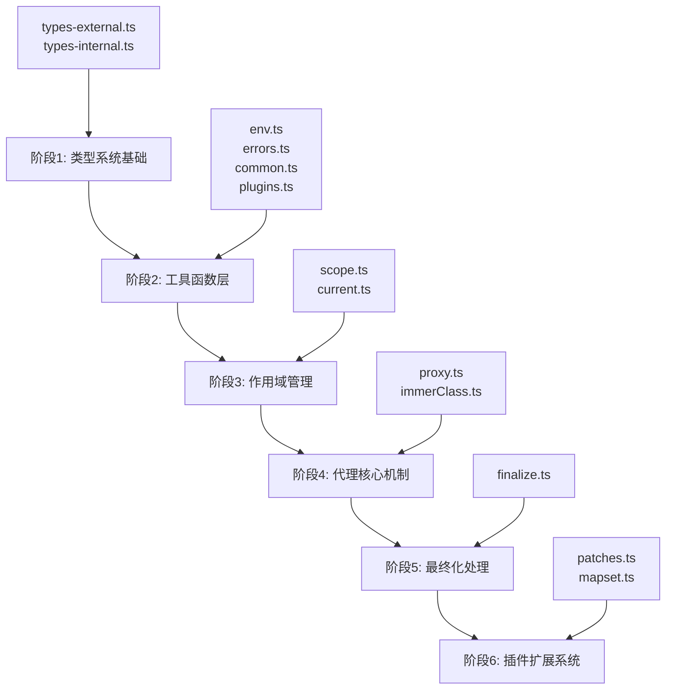

# 🎯 immer 源码学习路线图

> **创建时间**: 2024年12月
> **学习目标**: 深入理解 immer 不可变数据处理库的完整实现原理

## 📊 学习进度总览

### 整体进度
- [ ] 🎯 阶段1: 类型系统基础 (必须优先)
- [ ] 🛠️ 阶段2: 工具函数层 (基础设施)
- [ ] 🔄 阶段3: 作用域管理 (生命周期)
- [ ] ⚡ 阶段4: 代理核心机制 (重点难点)
- [ ] 🎯 阶段5: 最终化处理 (结果生成)
- [ ] 🔌 阶段6: 插件扩展系统 (高级特性)

### 学习统计
- **预计总时间**: 7-10 天
- **核心难点**: 阶段4 代理机制 (2-3天)
- **当前阶段**: 准备开始
- **完成度**: 0%

---

## 🗂️ 学习架构图



---

## 📚 详细学习路径

### 🎯 阶段 1: 类型系统基础 (必须优先)

**预计时间**: 1-2天
**重要程度**: ⭐⭐⭐⭐⭐
**目标**: 理解 immer 的核心类型概念

#### 学习文件清单
- [ ] `src/types/types-external.ts` - 对外类型定义
- [ ] `src/types/types-internal.ts` - 内部类型定义

#### 📖 重点学习内容

##### `src/types/types-external.ts`
- [ ] **`Draft<T>` 类型转换逻辑**
  - 理解如何将 `readonly` 类型转为可变
  - 递归处理嵌套对象的策略
  - 特殊类型（原始类型、函数、Promise等）的处理
- [ ] **`Immutable<T>` 定义**
  - 反向转换：可变 → 不可变
  - 与 Draft 的对称设计
- [ ] **`IProduce` 接口设计**
  - 重载函数的类型推断
  - 柯里化支持的类型实现
- [ ] **特殊值处理**
  - `NOTHING` 的类型定义和使用场景

##### `src/types/types-internal.ts`
- [ ] **`ImmerState` 内部状态**
  - 草稿对象的状态管理结构
  - 各字段的作用和生命周期
- [ ] **`ArchType` 架构类型枚举**
  - 不同数据类型的分类策略

#### 🔍 学习要点
1. **类型递归**: 理解 TypeScript 条件类型的递归处理
2. **边界处理**: 掌握各种边界情况的类型定义
3. **性能考虑**: 了解类型推断的性能影响

#### ✅ 验证标准
- [ ] 能解释 `Draft<ReadonlyArray<{readonly name: string}>>` 的转换过程
- [ ] 理解为什么需要 `NOTHING` 特殊值
- [ ] 能画出 `ImmerState` 的完整结构图

#### 📝 学习笔记
```
学习时间: _____
重点发现:
-
-
-

遇到难点:
-
-

```

---

### 🛠️ 阶段 2: 工具函数层 (基础设施)

**预计时间**: 1天
**重要程度**: ⭐⭐⭐⭐
**目标**: 掌握基础判断和操作函数

#### 学习文件清单
- [ ] `src/utils/env.ts` - 环境检测
- [ ] `src/utils/errors.ts` - 错误处理
- [ ] `src/utils/common.ts` - 核心工具函数 ⭐⭐⭐
- [ ] `src/utils/plugins.ts` - 插件管理

#### 📖 重点学习内容

##### `src/utils/env.ts`
- [ ] **环境检测逻辑**
  - Proxy 支持检测
  - 开发/生产环境适配

##### `src/utils/errors.ts`
- [ ] **错误处理机制**
  - 错误消息的延迟加载设计
  - 生产环境的错误优化

##### `src/utils/common.ts` ⭐⭐⭐ 核心文件
- [ ] **类型判断函数**
  - `isDraft` - 草稿对象识别
  - `isDraftable` - 可代理对象判断
  - `isPlainObject` - 普通对象检测
- [ ] **拷贝策略**
  - `shallowCopy` - 浅拷贝实现
  - 不同对象类型的拷贝策略
- [ ] **冻结逻辑**
  - `freeze` - 对象冻结实现
  - 深度冻结vs浅层冻结

##### `src/utils/plugins.ts`
- [ ] **插件注册机制**
  - 动态功能加载
  - 插件生命周期管理

#### 🔍 学习要点
1. **对象识别**: 掌握各种对象类型的判断逻辑
2. **拷贝策略**: 理解不同场景下的拷贝需求
3. **性能优化**: 了解延迟加载和缓存策略

#### ✅ 验证标准
- [ ] 能解释 `isDraftable` 的完整判断逻辑
- [ ] 理解 `shallowCopy` 的不同实现路径
- [ ] 掌握插件系统的注册和使用流程

#### 📝 学习笔记
```
学习时间: _____
重点发现:
-
-

代码片段摘抄:
```javascript
// 重要代码片段
```

遇到难点:
-
```

---

### 🔄 阶段 3: 作用域管理 (生命周期)

**预计时间**: 0.5天
**重要程度**: ⭐⭐⭐
**目标**: 理解 immer 的执行上下文管理

#### 学习文件清单
- [ ] `src/core/scope.ts` - 作用域管理 ⭐⭐⭐
- [ ] `src/core/current.ts` - 当前状态获取

#### 📖 重点学习内容

##### `src/core/scope.ts` ⭐⭐⭐ 核心文件
- [ ] **`ImmerScope` 作用域概念**
  - 作用域的数据结构设计
  - 作用域栈的管理策略
- [ ] **生命周期函数**
  - `enterScope` - 进入新作用域
  - `leaveScope` - 离开当前作用域
  - `revokeScope` - 撤销作用域
- [ ] **嵌套调用处理**
  - 多层 produce 调用的隔离
  - 作用域间的数据共享

##### `src/core/current.ts`
- [ ] **`current` 函数实现**
  - 草稿状态快照创建
  - 安全的状态访问机制

#### 🔍 学习要点
1. **作用域隔离**: 理解为什么需要作用域概念
2. **生命周期管理**: 掌握作用域的创建和销毁时机
3. **状态快照**: 了解如何安全地获取中间状态

#### ✅ 验证标准
- [ ] 能画出嵌套 produce 调用的作用域栈变化
- [ ] 理解 `current` 与直接访问草稿的区别
- [ ] 掌握作用域撤销的触发条件

#### 📝 学习笔记
```
学习时间: _____
重点发现:
-

作用域生命周期图:
[在这里画图或描述]

遇到难点:
-
```

---

### ⚡ 阶段 4: 代理核心机制 (重点难点)

**预计时间**: 2-3天
**重要程度**: ⭐⭐⭐⭐⭐
**目标**: 深入理解写时复制的核心实现

#### 学习文件清单
- [ ] `src/core/proxy.ts` - 代理实现 ⭐⭐⭐⭐⭐
- [ ] `src/core/immerClass.ts` - Immer主类 ⭐⭐⭐⭐⭐

#### 📖 重点学习内容

##### `src/core/proxy.ts` ⭐⭐⭐⭐⭐ 最核心文件
- [ ] **代理创建**
  - `createProxyProxy` - 代理工厂函数
  - 不同架构类型的代理策略
- [ ] **Proxy 陷阱实现**
  - `get` 陷阱 - 属性访问拦截
  - `set` 陷阱 - 属性修改拦截
  - `has` 陷阱 - 属性存在检查
  - `deleteProperty` 陷阱 - 属性删除
- [ ] **写时复制触发**
  - 修改检测机制
  - `assigned_` 字段的状态跟踪
  - 嵌套代理的延迟创建
- [ ] **状态管理**
  - `ImmerState` 的状态转换
  - `copy_` 字段的创建时机

##### `src/core/immerClass.ts` ⭐⭐⭐⭐⭐ 协调中心
- [ ] **Immer 类设计**
  - 构造函数和配置管理
  - 实例方法的绑定策略
- [ ] **`produce` 方法核心逻辑**
  - 参数解析和重载处理
  - 作用域创建和管理
  - 代理创建的触发时机
  - 结果处理的完整流程
- [ ] **配置系统**
  - `autoFreeze` 自动冻结控制
  - `useStrictShallowCopy` 严格拷贝模式

#### 🔍 学习要点
1. **代理机制**: 理解 Proxy 如何实现透明的写时复制
2. **延迟策略**: 掌握延迟创建和延迟拷贝的时机
3. **状态追踪**: 了解如何高效地跟踪对象修改
4. **性能优化**: 理解各种性能优化策略

#### ✅ 验证标准
- [ ] 能手画出完整的代理创建和触发流程图
- [ ] 理解 `get` 陷阱中的延迟代理创建逻辑
- [ ] 掌握写时复制的具体触发时机
- [ ] 能解释 `produce` 方法的完整执行流程

#### 🔧 实践建议
1. **单步调试**: 使用调试器跟踪一个简单的 produce 调用
2. **流程图**: 为复杂的代理逻辑画出详细的流程图
3. **状态追踪**: 观察 `ImmerState` 在不同阶段的变化

#### 📝 学习笔记
```
学习时间: _____
重点发现:
-

代理创建流程图:
[在这里画图或描述]

写时复制触发条件:
-
-

最复杂的部分:
-

遇到难点:
-
```

---

### 🎯 阶段 5: 最终化处理 (结果生成)

**预计时间**: 1天
**重要程度**: ⭐⭐⭐⭐
**目标**: 理解如何从草稿生成最终结果

#### 学习文件清单
- [ ] `src/core/finalize.ts` - 最终化逻辑 ⭐⭐⭐⭐

#### 📖 重点学习内容

##### `src/core/finalize.ts` ⭐⭐⭐⭐ 核心文件
- [ ] **结果处理入口**
  - `processResult` - 结果处理主函数
  - 不同返回值类型的处理策略
- [ ] **最终化算法**
  - `finalize` - 递归最终化逻辑
  - 深度优先遍历策略
- [ ] **结构共享优化**
  - 未修改对象的共享机制
  - 内存使用优化策略
- [ ] **冻结处理**
  - 自动冻结的实现
  - 递归冻结的性能考虑

#### 🔍 学习要点
1. **算法理解**: 掌握递归最终化的算法逻辑
2. **性能优化**: 理解结构共享的性能优势
3. **内存管理**: 了解如何减少不必要的对象创建
4. **冻结策略**: 掌握对象冻结的时机和深度

#### ✅ 验证标准
- [ ] 能解释结构共享如何减少内存开销
- [ ] 理解最终化过程的递归深度控制
- [ ] 掌握自动冻结的性能影响

#### 📝 学习笔记
```
学习时间: _____
重点发现:
-

最终化算法步骤:
1.
2.
3.

性能优化策略:
-
-

遇到难点:
-
```

---

### 🔌 阶段 6: 插件扩展系统 (高级特性)

**预计时间**: 1-2天
**重要程度**: ⭐⭐⭐
**目标**: 理解功能扩展机制

#### 学习文件清单
- [ ] `src/plugins/patches.ts` - 补丁系统 ⭐⭐⭐⭐
- [ ] `src/plugins/mapset.ts` - Map/Set支持 ⭐⭐⭐

#### 📖 重点学习内容

##### `src/plugins/patches.ts` ⭐⭐⭐⭐ 变更追踪
- [ ] **补丁生成算法**
  - `generatePatches_` - 补丁生成核心
  - 不同类型变更的处理策略
- [ ] **`applyPatches` 实现**
  - 补丁应用的算法逻辑
  - 路径解析和值设置
- [ ] **逆向补丁**
  - `inversePatches` 的生成逻辑
  - 撤销操作的支持
- [ ] **插件集成**
  - 与核心系统的集成方式
  - 生命周期钩子的使用

##### `src/plugins/mapset.ts` ⭐⭐⭐ 集合类型支持
- [ ] **`DraftMap` 实现**
  - Map 代理的特殊处理
  - 写时复制在 Map 上的应用
- [ ] **`DraftSet` 实现**
  - Set 代理的实现策略
  - 集合操作的代理逻辑
- [ ] **集合类型的最终化**
  - Map/Set 的特殊最终化逻辑

#### 🔍 学习要点
1. **变更追踪**: 理解补丁算法的设计思路
2. **集合代理**: 掌握复杂数据结构的代理实现
3. **插件架构**: 了解功能模块化的设计原则
4. **性能考虑**: 理解插件功能的性能影响

#### ✅ 验证标准
- [ ] 能解释补丁生成的完整算法
- [ ] 理解 Map/Set 代理的特殊处理
- [ ] 掌握插件系统的集成机制

#### 📝 学习笔记
```
学习时间: _____
重点发现:
-

补丁算法总结:
-
-

Map/Set 特殊处理:
-
-

插件设计亮点:
-
-

遇到难点:
-
```

---

## 🎯 学习总结和进阶

### 📊 学习完成情况统计
- [ ] 阶段1: 类型系统基础 (___%完成)
- [ ] 阶段2: 工具函数层 (___%完成)
- [ ] 阶段3: 作用域管理 (___%完成)
- [ ] 阶段4: 代理核心机制 (___%完成)
- [ ] 阶段5: 最终化处理 (___%完成)
- [ ] 阶段6: 插件扩展系统 (___%完成)

### 🏆 核心收获总结
```
最重要的技术洞察:
1.
2.
3.

最佳设计模式:
1.
2.
3.

性能优化技巧:
1.
2.
3.

可应用到其他项目的思路:
1.
2.
3.
```

### 🚀 进阶学习建议
- [ ] **性能分析**: 使用性能测试分析各个阶段的耗时
- [ ] **源码改进**: 尝试提出可能的优化方案
- [ ] **功能扩展**: 设计并实现一个新的插件功能
- [ ] **类似库对比**: 对比 immer 与其他不可变数据库的设计差异

### 📚 相关学习资源
- [ ] [immer 官方文档](https://immerjs.github.io/immer/)
- [ ] [Proxy MDN 文档](https://developer.mozilla.org/en-US/docs/Web/JavaScript/Reference/Global_Objects/Proxy)
- [ ] [TypeScript 条件类型](https://www.typescriptlang.org/docs/handbook/2/conditional-types.html)
- [ ] [写时复制 Wikipedia](https://en.wikipedia.org/wiki/Copy-on-write)

---

## 🔧 学习工具和环境

### 调试环境
- VS Code 断点调试配置已就绪
- `dev-playground.js` 实验环境可用
- Jest 测试环境支持实时调试

### 有用的调试命令
```bash
# 实时测试
yarn watch

# 开发调试
yarn dev

# 性能测试
yarn test:perf

# 构建测试
yarn test:build
```

### 学习进度更新
**更新时间**: ________
**当前阶段**: ________
**遇到的主要挑战**: ________
**下一步计划**: ________

---

*📝 提示: 这个文档是你的学习伙伴，随时更新你的进度、发现和思考。学习过程中遇到问题时，可以随时回来查看相关章节！*